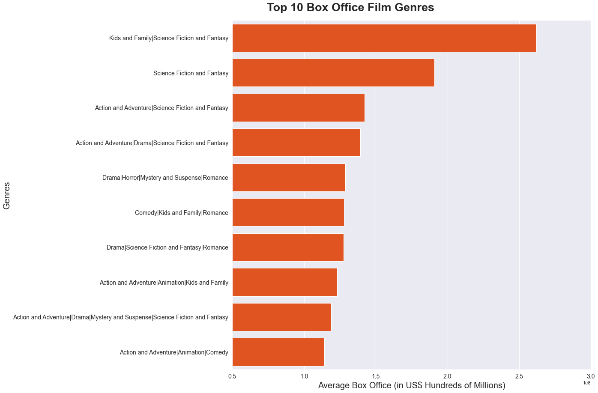
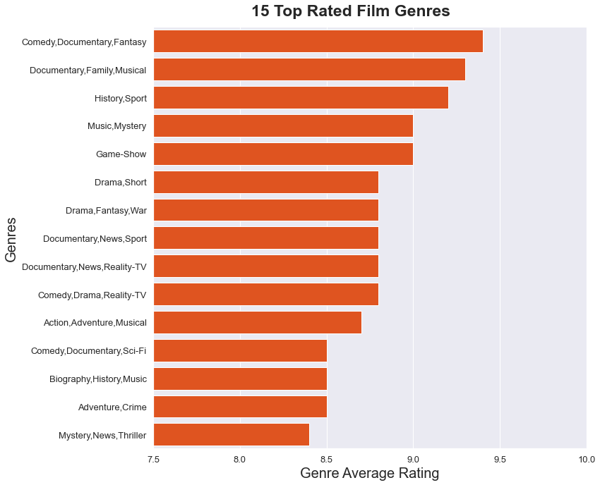
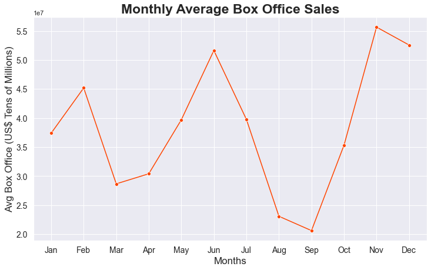
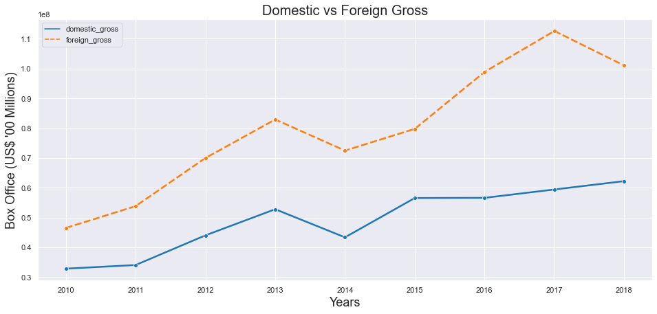
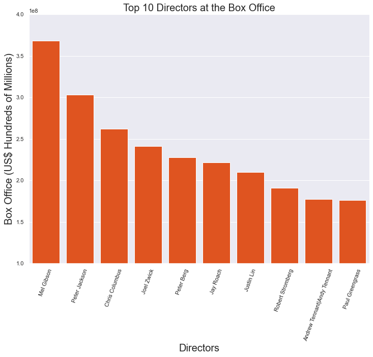

# Microsoft Movie Analysis

#### Author: [Steve Mukara Githinji](linkedin.com/in/steve-githinji-10ba0114a)

## Overview

This project analyzes data on movies to assist Microsoft's new movie studio make informed decisions on what types of fiims to create. This analysis showed that 'Kids and Family|Science Fiction and Fantasy' and 'Science Fiction and Fantasy' genres of films earned the most at the box office. Films also performed better internationally at the box office than in the USA. On average, films released in June, November and December earned the most at the box office. The analysis showed that 'Comedy, Documentary, Fantasy' and 'Documentary, Family, Musical' genres were the high rated by viewers. 

## Business Problem

Microsoft plans to dive into the lucrative multi-billion dollar film industry by setting up its own movie studio. It wants to set up a new movie studio. However, it has no prior experience in the film industry. An analysis is needed to explore what genres of films are doing the best at the box office. These findings should translate into actionable insights for the Microsoft executives.

## Data

The source of the data used in this project is online databases of information related to films and television series. These are IMDB, Box Office Mojo and Rotten Tomatoes. [IMDB](https://www.imdb.com/) data was a SQLite databas with 8 related tables of data such as movie ratings, movie akas, directors, writers etc, and data for over 73,000 films. [Box Office Mojo](https://www.boxofficemojo.com/) data was in a CSV format which detailed each film's studio, domestic gross earnings, foreign gross earnings and year of release. It contained data for 3387 films. Its major limitation was that it did not show each film's genre. [Rotten Tomatoes](https://www.rottentomatoes.com/) data was in a TSV format containing 11 columns and 1560 rows of individual films. The important categories from this dataset were rating, genre, director and box office earnings.

## Methods

This project used descriptive analysis and data visualization, including description of trends over time. 
Technologies used include:
* Python
* Jupyter Notebook
* Pandas, Matplotlib, SQLite3, Numpy & Seaborn libraries

## Results

Highest earners are **`Kids and Family|Science Fiction and Fantasy`**, **`Science Fiction and Fantasy, Action`** and **`Adventure|Science Fiction and Fantasy`**. All these are a combination of **`Science Fiction and other genres`**.

Top rated genres are **`Comedy, Documentary, Fantasy`**, **`Documentary, Family, Musical`** and **`History, Sport`**.

Top movie release months are **`November`**, **`December`** and **`June`**. Worst months are **`August`** and **`September`**.

Foreign markets consistently perform better at the box office.

The highest earning directors at the box office are Mel Gibson, Peter Jackson and Chris Columbus.

## Conclusions

The analysis leads to the following recommendatioins:

* Microsoft should create flims under Comedy, Documentary, Fantasy, Documentary, Family, Musical and History, Sport genres to increase chances of racking up positive reviews.
* Microsoft should make Science Fiction movies for high box office sales.
* Fimsto be released in the months with the highest demands i.e. November , December and June.
* The new movie studio should hire Mel Gibson, Peter Jackson and Chris Columbus to direct its movies.
* The marketing budget should prioritize the foreign market (outside USA).

The analysis may not fully solve the business problem because it did not address the online video on demand industry. Online subscription services are an emerging trend and its impact on the film industry should be analyzed.

### Next Steps

A further study may be required to determine the following:
* Correlation between production budget and box office gross
* Comparison between big screen releases and the now popular online subscription services.
* Analysis of the best performing markets outside the United States.

## For More Information

See the full analysis in the [Jupyter Notebook](https://github.com/stevegithinji/Movies-Analysis/blob/master/microsoft_movie_analysis.ipynb) or review this [presentation](https://github.com/stevegithinji/Movies-Analysis/blob/master/Presentation.pdf).

For additional info, contact Steve Mukara Githinji at githinjisteve96@gmail.com.

